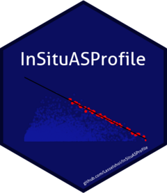

<!-- README.md is generated from README.Rmd. Please edit that file -->

```{r, include = FALSE}
knitr::opts_chunk$set(
  collapse = TRUE,
  comment = "#>",
  fig.path = "man/figures/README-",
  out.width = "100%"
)
```

# InSituASProfile

<!-- badges: start -->
<!-- badges: end -->

The goal of InSituASProfile is to provide an easy way to calculate the insitu sprint acceleration-speed profile based on gps data using the method described by Morin et al. 2021 published in Journal of Biomechanics, DOI: 10.1016/j.jbiomech.2021.110524

## Installation

You can install the development version of InSituASProfile from [GitHub](https://github.com/) with:

``` r
# install.packages("devtools")
devtools::install_github("LasseIshoi/InSituASProfile")
```

## Example

This is a basic example which shows you how to solve a common problem:

```{r example}
library(InSituASProfile)
## basic example code
```

What is special about using `README.Rmd` instead of just `README.md`? You can include R chunks like so:

```

```

You'll still need to render `README.Rmd` regularly, to keep `README.md` up-to-date. `devtools::build_readme()` is handy for this. You could also use GitHub Actions to re-render `README.Rmd` every time you push. An example workflow can be found here: <https://github.com/r-lib/actions/tree/v1/examples>.

You can also embed plots, for example:

```html
<logo>

</logo>
```

In that case, don't forget to commit and push the resulting figure files, so they display on GitHub and CRAN.
